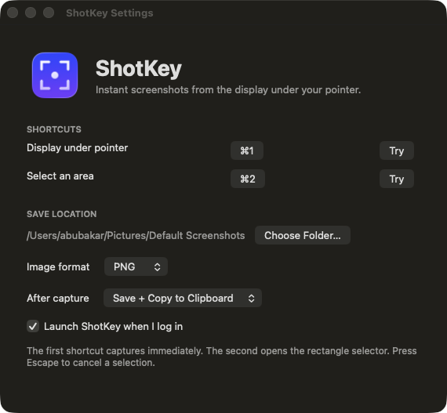

# ShotKey

<p align="center">
  
</p>

<p align="center"><strong>A quicker, simpler screenshot app for Mac.</strong></p>

I made ShotKey because taking a screenshot on my Mac felt like more work than it should be. I use an ultrawide display together with my Mac's internal screen, and I wanted one shortcut that simply captures the screen under my mouse—without stopping to choose the correct display every time.

I also wanted a second shortcut where I could drag a rectangle around exactly what I needed, release the mouse, and be done. The result should go where *I* want it: into a folder, onto the clipboard, or both.

So I created ShotKey. It is a small native menu-bar app focused on making those two actions fast and dependable.



## What ShotKey does

- Captures the entire display currently under your mouse pointer.
- Lets you drag to capture any rectangular area.
- Works with an external or ultrawide display as well as the Mac's built-in screen.
- Lets you choose your own global shortcuts.
- Offers three clear results after every capture:
  - save the image and copy it to the clipboard;
  - copy it to the clipboard only;
  - save it to a folder only.
- Saves as PNG or JPEG in the folder you choose.
- Can launch automatically when you log in.
- Lives quietly in the menu bar and supports **Quit ShotKey (⌘Q)**.
- Processes screenshots locally. ShotKey has no account, cloud upload, tracking, or analytics.

## Install

ShotKey 1.2 currently provides an Apple silicon build for macOS 14 or newer.

1. Download [ShotKey 1.2](outputs/ShotKey-1.2.dmg).
2. Open the DMG and drag ShotKey into **Applications**.
3. Open ShotKey and allow **Screen & System Audio Recording** when macOS asks.
4. Use **Quit & Reopen** if macOS shows that button.
5. Choose your shortcuts, save folder, image format, and output behavior.

macOS may warn that it cannot verify an independently distributed app. If that happens, open **System Settings → Privacy & Security**, scroll down, and choose **Open Anyway** for ShotKey.

If macOS shows the permission as enabled but ShotKey still cannot capture, follow the short [permission repair guide](docs/TROUBLESHOOTING.md).

## Using it

Open ShotKey from the menu bar whenever you want to change a setting.

- **Display under pointer** immediately captures whichever display contains the mouse pointer.
- **Select an area** darkens that display and gives you a crosshair. Drag over the area you want and release to capture. Press **Escape** to cancel.

The defaults are F6 and F7 on a new installation, but the buttons in Settings let you record the keys you prefer. The screenshot above shows my own setup using ⌘1 and ⌘2.

## Build it yourself

You need Xcode Command Line Tools and macOS 14 or newer.

```bash
git clone https://github.com/abubkr01/ShotKey.git
cd ShotKey
./build-app.sh
```

The app will be created at `outputs/ShotKey.app`. To make the installer too:

```bash
./package-dmg.sh
```

More detail is in [Development](docs/DEVELOPMENT.md).

## Where I want to take it

This release solves the part I missed most from ShareX: fast capture with predictable output. Later experiments may add a lightweight editor for arrows, rectangles, text, blur, and other quick annotations. I want to keep the basic capture experience simple even as the app grows.

The working v1.2 state is preserved in the `checkpoint/v1.2.0` branch and the local `v1.2.0` tag, so future experiments can always return to this exact checkpoint.

## License

ShotKey is available under the [MIT License](LICENSE).
